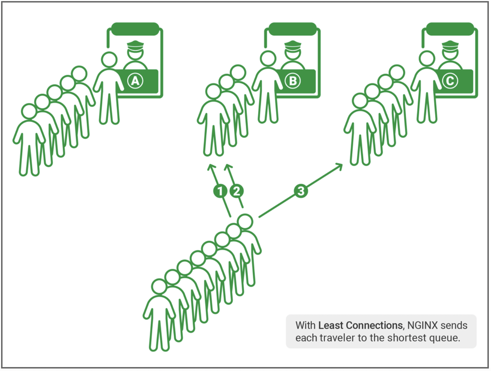

# Desafio
Fazer uma API com 2 instâncias sendo balanceada pelo Nginx (A estratégia de balanceamento para suas APIs pode ser do tipo round-robin ou fair distribution) e com banco de dados (MySQL, Postgres ou MongoDB), tudo isso deve rodar dentro de uma VM mínima de só 1.5 vCPU e 3GB de RAM, e deve suportar uma bateria de stress test de Gatling brutal em cima. Todos os componentes da solução devem rodar em containers Docker via docker-compose.

Link do desafio original: https://github.com/zanfranceschi/rinha-de-backend-2023-q3

# Desenho da solução:

Todos os componentes da solução estão rodando em containers Docker provisionados pelo docker-compose

## Estratégias utilizadas para performance

### Least Connections Load Balancing
A estratégia de balanceamento utilizada foi a fair distribution, mais especificamente a "Least Connections", esta escolha foi feita visando melhorar a disponibilidade e performance das instâncias. 

Essa estratégia busca distribuir solicitações para as instâncias de forma que a instância com o menor número de conexões ativas seja escolhida para receber a próxima solicitação.

### Index
[Problemas de desempenho, como lentidão, podem ser reduzidos em até 50% após criação de index](https://youtu.be/0TMr8rsmU-k?si=7P9A69yanuie5fu1&t=2719), proporcionando um ganho significativo de desempenho.

Então como medida preventiva, para evitar problemas de desempenho, foram criados indexes no banco de dados na tabela `pessoas` para as colunas `id` e `searchable`, criei index nessas colunas pois são utilizadas em queries nas cláusuras `WHERE` 

### Indexação de pesquisa textual

Eu tinha feito essa modelagem:

Justamente pra poder executar essa query na [busca por termo](https://github.com/zanfranceschi/rinha-de-backend-2023-q3/blob/main/INSTRUCOES.md#busca-de-pessoas):

    SELECT DISTINCT p.id, p.apelido, p.nome, p.nascimento
    FROM pessoas p INNER JOIN stacks s
    ON p.id = s.pessoa_foreign_key
    WHERE p.apelido ILIKE '%termo%'
    OR p.nome ILIKE '%termo%'
    OR s.nome ILIKE '%termo%'

Que funciona, mas sei que `subselects` não são performáticos quando são utilizados em `WHERE`.

Assisti [um vídeo do Fabio Akita](https://youtu.be/EifK2a_5K_U?si=xL7RDnAtjgnlNpxO&t=2826) e [do MrPowerGamerBR](https://youtu.be/XqYdhlkRlus?t=277), onde eles falam sobre a rinha de backend, e ambos deram a sugestão de utilizar **indexação de pesquisa textual**, invés de `subselects`.

Aceitei a sugestão deles e refatorei meu código, [transformei stack em um array de string dentro da tabela Pessoa](https://github.com/DeveloperArthur/rinha-de-backend-2023/commit/7fdd803d7c6661117fdcca6cf8f93d77f7a9a839), [removi a entidade Stack](https://github.com/DeveloperArthur/rinha-de-backend-2023/commit/797113cfb730c90e00c6a3f45137340e6b96351e), criei um campo Searchable na model Pessoa e um método que popula esse campo:

    func (pessoa *Pessoa) SetSearchable() {
        pessoa.Searchable = pessoa.Nome + pessoa.Apelido
        for _, s := range pessoa.Stack {
            pessoa.Searchable += s
        }
    }

### Fila & cache
[Serviço de fila e cache costumam resolver 80% dos problemas de escalabilidade](https://youtu.be/0TMr8rsmU-k?si=JtA2c28HMNBFo3Sb&t=2610), portanto:

Foi utilizado serviço de fila com RabbitMQ nos endpoints de criação de pessoas, as instâncias irão enviar o payload para o serviço de fila, que irá enfileirar e gravar 1 pessoa de cada vez, evitando que o banco de dados seja sobrecarregado.

e foi utilizado serviço de cache com Redis nos endpoints de busca de pessoas por id e busca de pessoas por termo:

- No caching por termo foi utilizado a estratégia Cache TTL, com expiração de 3 minutos, pois uma nova pessoa pode ser criada e não podemos retornar a lista com resultados inconsistentes/desatualizados.
- No caching por id também foi utilizado a estratégia de Cache TTL, mas com expiração de 10 minutos, pois iremos gravar pessoas no caching logo após enfileirar, e o tempo de expiração não pode ser pequeno, pois isso pode gerar inconsistência/divergência de dados (explico melhor no próximo tópico).

### Programação Paralela/Reativa não bloqueante
Como medida preventiva, para contornar a divergência de dados que será gerada devido a consistência eventual da fila, iremos gravar a pessoa no cache logo após enviar o payload para o serviço de fila, isso será feito para evitar que o usuário busque as informações da pessoa logo após cadastra-la e a API retorne `404 Pessoa não encontrada`, isso pode acontecer se a pessoa ainda estiver na fila, ou seja, ainda não foi persistida no banco de dados.

E iremos utilizar programação paralela neste caso pois os processos de **enfileirar pessoa** e **gravar pessoa no caching** serão realizados **ao mesmo tempo**.

## Resultado final: 