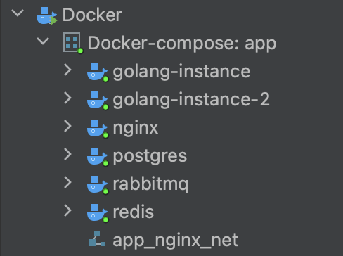
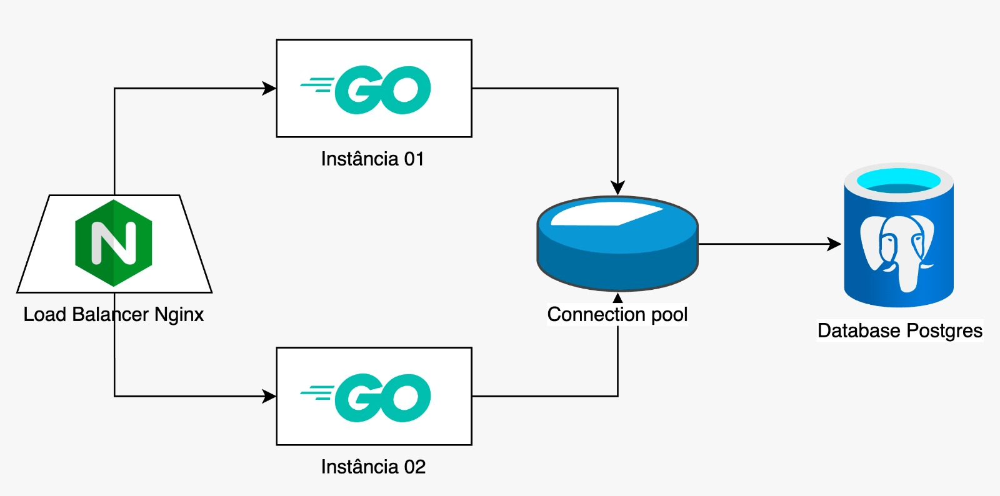

# Desafio
Fazer uma API com 2 instâncias sendo balanceada pelo Nginx (A estratégia de balanceamento para suas APIs pode ser do tipo round-robin ou fair distribution) e com banco de dados (MySQL, Postgres ou MongoDB), tudo isso deve rodar dentro de uma VM mínima de só 1.5 vCPU e 3GB de RAM, e deve suportar uma bateria de stress test de Gatling brutal em cima. Todos os componentes da solução devem rodar em containers Docker via docker-compose.

Link do desafio original: https://github.com/zanfranceschi/rinha-de-backend-2023-q3

# Desenho da solução:

## Infraestrutura da solução

Todos os componentes da solução irão rodar dentro de uma VM, provisionada pelo Vagrant:

Dentro da VM, os componentes da solução irão rodar em containers Docker provisionados pelo docker-compose:

## Estratégias utilizadas para performance

### Index
[Problemas de desempenho, como lentidão, podem ser reduzidos em até 50% após criação de index](https://youtu.be/0TMr8rsmU-k?si=7P9A69yanuie5fu1&t=2719), proporcionando um ganho significativo de desempenho.

Então como medida preventiva, para evitar problemas de desempenho, foram criados indexes no banco de dados na tabela `pessoas` para as colunas `id` e `searchable`, criei index nessas colunas pois são utilizadas em queries nas cláusuras `WHERE` 

### Indexação de pesquisa textual

Eu tinha feito essa modelagem:

Justamente pra poder executar essa query na [busca por termo](https://github.com/zanfranceschi/rinha-de-backend-2023-q3/blob/main/INSTRUCOES.md#busca-de-pessoas):

    SELECT DISTINCT p.id, p.apelido, p.nome, p.nascimento
    FROM pessoas p INNER JOIN stacks s
    ON p.id = s.pessoa_foreign_key
    WHERE p.apelido ILIKE '%termo%'
    OR p.nome ILIKE '%termo%'
    OR s.nome ILIKE '%termo%'

A query funciona mas não é a forma mais performática, muito pesada:

Então segui a sugestão do [Fabio Akita](https://youtu.be/EifK2a_5K_U?si=xL7RDnAtjgnlNpxO&t=2826) e do [MrPowerGamerBR](https://youtu.be/XqYdhlkRlus?t=277) de utilizar **indexação de pesquisa textual** e refatorei meu código

[Transformei stack em um array de string dentro da tabela Pessoa](https://github.com/DeveloperArthur/rinha-de-backend-2023/commit/7fdd803d7c6661117fdcca6cf8f93d77f7a9a839) e [removi a entidade Stack](https://github.com/DeveloperArthur/rinha-de-backend-2023/commit/797113cfb730c90e00c6a3f45137340e6b96351e), criei um campo Searchable na model Pessoa e um método que popula esse campo:

    func (pessoa *Pessoa) SetSearchable() {
        pessoa.Searchable = pessoa.Nome + pessoa.Apelido
        for _, s := range pessoa.Stack {
            pessoa.Searchable += s
        }
    }

A performance melhorou consideravelmente:

### Fila & cache
[Serviço de fila e cache costumam resolver 80% dos problemas de escalabilidade](https://youtu.be/0TMr8rsmU-k?si=JtA2c28HMNBFo3Sb&t=2610), portanto:

Foi utilizado serviço de fila com RabbitMQ nos endpoints de criação de pessoas, as instâncias irão enviar o payload para o serviço de fila, que irá enfileirar e gravar 1 pessoa de cada vez, evitando que o banco de dados seja sobrecarregado.

e foi utilizado serviço de cache com Redis nos endpoints de busca de pessoas por id e busca de pessoas por termo:

- No caching por termo foi utilizado a estratégia Cache TTL, com expiração de 3 minutos, pois uma nova pessoa pode ser criada e não podemos retornar a lista com resultados inconsistentes/desatualizados.
- No caching por id também foi utilizado a estratégia de Cache TTL, mas com expiração de 10 minutos, pois iremos gravar pessoas no caching logo após enfileirar, e o tempo de expiração não pode ser pequeno, pois isso pode gerar inconsistência/divergência de dados (explico melhor no próximo tópico).

### Programação Paralela/Reativa não bloqueante
Como medida preventiva, para contornar a divergência de dados que será gerada devido a consistência eventual da fila, iremos gravar a pessoa no cache logo após enviar o payload para o serviço de fila, isso será feito para evitar que o usuário busque as informações da pessoa logo após cadastra-la e a API retorne `404 Pessoa não encontrada`, isso pode acontecer se a pessoa ainda estiver na fila, ou seja, ainda não foi persistida no banco de dados.

E iremos utilizar programação paralela neste caso pois os processos de **enfileirar pessoa** e **gravar pessoa no caching** serão realizados **ao mesmo tempo**.

### Least Connections Load Balancing
A estratégia de balanceamento utilizada no Nginx foi a "Least Connections", esta escolha foi feita visando melhorar a disponibilidade e performance das instâncias. 

Essa estratégia busca distribuir solicitações para as instâncias de forma que a instância com o menor número de conexões ativas seja escolhida para receber a próxima solicitação.

## Executando teste:

Para realizar a execução do teste, basta rodar os seguintes comandos:

    cd rinha-de-backend-2023/app
    vagrant init hashicorp/bionic64
    vagrant up

O Vagrantfile vai iniciar a VM e realizar as configurações necessárias: criar imagem docker, executar o gatling etc

Quando o teste finalizar, execute os seguintes comandos:
    
    vagrant ssh # para conferir qual foi o resultado
    vagrant destroy # para destruir a VM

## Resultado final: 

Minha solução alcançou incríveis 386 inserções, com essa contagem eu ficaria em 51º lugar (penúltimo) na competição, eu ficaria abaixo do "leandronsp-bash" que fez 17 inserções, e acima de mim ficaria "wendryo" que fez 2.835 inserções.

# Segunda chance

Decidi fazer algumas alterações na minha solução afim de conseguir um resultado melhor.

## Desenho da nova solução

## Alterações para melhorar a performance

### Remoção do serviço de caching Redis

[Removi o Redis da solução]() pois no meu contexto não compensa utilizar caching, [o tempo para gravar no Postgres é tão rápido quanto.](https://youtu.be/-yGHG3pnHLg?si=g2fb5MmL3Swy_CXI&t=2299)

### Configuração de campo como UNIQUE e remoção do serviço de fila RabbitMQ

Na primeira versão, toda vez que ia cadastrar um registro, eu fazia uma consulta no banco antes para ver se o apelido 
já estava em uso, [realizei uma alteração](https://github.com/DeveloperArthur/rinha-de-backend-2023/commit/23d8fb2617bd0f61139d372049116885bc2e4726) 
para não fazer mais essas consultas toda vez antes do cadastro, alterei o campo `apelido` no banco para `UNIQUE` pra garantir a unicidade 
do apelido. Antes eu consultava o apelido no banco, e inseria assincronamente com RabbitMQ, e agora como não vou mais 
consultar no banco, não pode ser assíncrono... pois se tentar cadastrar um apelido já utilizado, o banco vai retornar 
erro, a API tem que tratar esse erro e retornar para o front na hora, então a inserção tem que ser síncrona, por esse 
motivo removi o RabbitMQ da solução, não será mais necessário.

### Configuração de worker e pool de connections

Peguei a dica do @leandronsp nesse tweet: 

E configurei o `worker_connections` do Nginx pra 256, na API deixei o connection pool de 15, e no Postgres `max_connections` pra 30:

## Resultado final